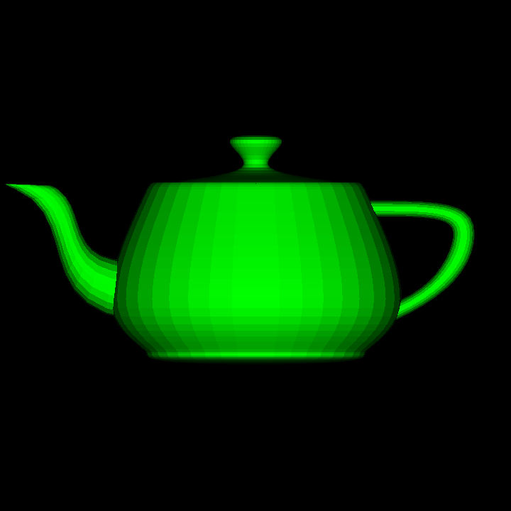
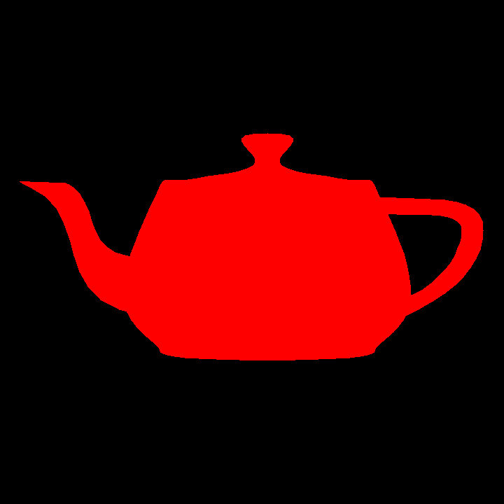

# RastC
A custom software rasterizer written in pure C.

## Features:
-Wireframe rendering mode.\
-Unlit polygonal rendering mode.\
-Shaded polygonal rendering mode.\
-Depth buffer.\
-OBJ input.\
-PPM output.

## Compilation:
Install [GCC](https://gcc.gnu.org/) and then run "make" once you are in the project folder. Please note, this program currently supports only triangulated .obj files.

## Project Structure:
src/ <- This is the folder with the source code.\
res/ <- This is where 3D models should be stored.\
doc/ <- This is where documentation is stored.\
out.ppm <- Will be the output of the renderer, easily viewable in [GIMP](https://www.gimp.org/downloads/).\
Makefile <- This is the script used for compilation.

## Sample Output:
Shaded Mode\
\
Wireframe Mode\
\
Unlit Mode\

## 3D Model Credit:
[Utah Teapot 3D Model](https://users.cs.utah.edu/~dejohnso/models/teapot.html)
